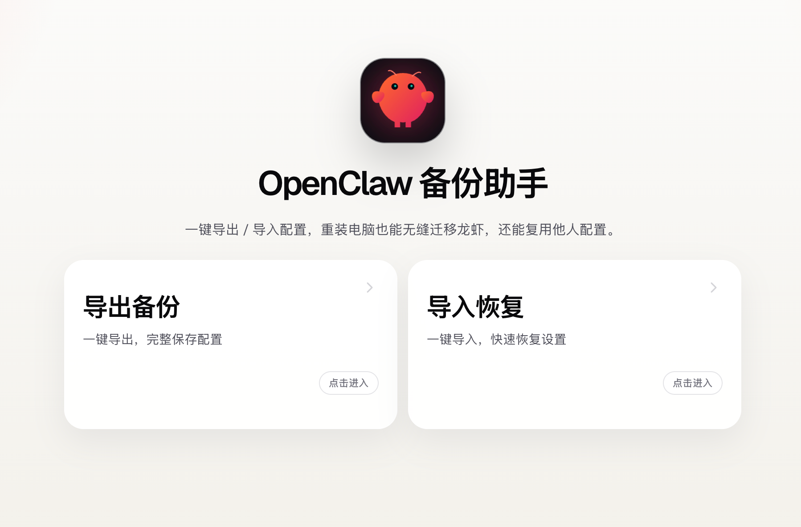

# OpenClaw 备份助手



一个面向本地 OpenClaw 用户的桌面备份与迁移工具。

它的目标很直接：帮用户把旧电脑里的 OpenClaw 配置、认证信息、记忆、会话历史、插件扩展和定时任务打包带走，再在新电脑上尽可能稳地恢复回来，减少“换电脑后一切重配”的痛苦。

## 为什么做这个项目

真实的 OpenClaw 迁移过程通常很痛苦：

- 用户不知道 `~/.openclaw` 里哪些内容必须备份
- 手工复制时容易漏掉认证配置、设备身份或会话历史
- 插件扩展、技能和工作区经常一起丢
- 新旧电脑版本不一致时，恢复后可能出现兼容问题
- 敏感信息“全拷不安全，不拷又要重配”

这个项目的重点不是“做一个压缩包工具”，而是做一个更适合真实迁移场景的 OpenClaw 本地备份助手。

## 核心能力

- 自动识别默认 OpenClaw 根目录：`~/.openclaw`
- 扫描真实可迁移项目并显示可用状态
- 导出 zip 备份包
- 导入 zip 备份包
- 导入前预检查
- 检测 OpenClaw 可能正在运行的情况
- 支持“包含敏感信息”与“排除敏感信息”
- 对 `openclaw.json` 做脱敏导出
- 导入时支持单项失败继续
- 导入完成后展示成功、失败、告警结果
- 全程本地离线，不依赖云服务

## 当前识别的备份项

当前版本已对齐真实的 OpenClaw 目录结构，主要识别这些内容：

- `openclaw.json`
- `agents/main/agent/auth-profiles.json`
- `identity/`
- `memory/`
- `skills/`
- `workspace/`
- `agents/main/agent/models.json`
- `agents/main/sessions/`
- `extensions/`
- `cron/jobs.json`

## 敏感信息策略

导出时有两种模式：

### 1. 包含敏感信息

- 会把认证配置、设备身份、Channel 密钥等一并带上
- 恢复后更接近“原样迁移”
- 但备份包一旦泄露，风险更高

### 2. 排除敏感信息

- 纯敏感项会直接不进入备份包
- `openclaw.json` 仍会被保留，但像 `token`、`appSecret`、`key`、`access`、`refresh` 这类字段会被替换为 `"<redacted>"`
- 恢复后用户需要手动补填 API Key、Token、Secret 等信息

## 使用场景

适合：

- 本地部署 OpenClaw 的 macOS 用户
- 换电脑迁移
- 重装系统前做完整备份
- 想把现有配置导出后再导入到另一台机器

暂不承诺：

- Windows 正式支持
- 不同大版本 OpenClaw 的绝对兼容
- 云端部署 OpenClaw 的数据迁移
- 自动重启 OpenClaw

## 使用方式

### 直接使用桌面应用

下载 `.dmg` 后：

1. 双击打开 `.dmg`
2. 将 `OpenClaw 备份助手.app` 拖到 `Applications`
3. 首次打开若被 macOS 拦截，右键应用并选择 `打开`

### 开发环境运行

```bash
cd openclaw-backup
npm install
npm run tauri:dev
```

如果只想看前端页面：

```bash
cd openclaw-backup
npm install
npm run dev
```

## 打包构建

### 构建 macOS dmg

```bash
cd openclaw-backup
npm install
npx tauri build --bundles dmg
```

构建产物通常位于：

```bash
src-tauri/target/release/bundle/dmg/
```

## 使用流程

### 导出备份

1. 启动应用
2. 进入“导出备份”
3. 确认 OpenClaw 根目录
4. 勾选需要备份的项目
5. 选择是否包含敏感信息
6. 选择保存位置并导出

### 导入恢复

1. 启动应用
2. 进入“导入恢复”
3. 选择目标 OpenClaw 根目录
4. 选择备份包
5. 阅读预检查结果和风险提示
6. 勾选要恢复的项目
7. 确认导入
8. 导入完成后手动重启 OpenClaw

## 注意事项

- 最稳妥的迁移方式是：新旧机器使用相同或相近版本的 OpenClaw
- 如果版本差异明显，导入前请先看预检查结果
- 导入是覆盖式恢复，请确认目标目录没有你不想被替换的内容
- 如果导出时排除了敏感信息，恢复后需要手动补齐 API Key、Token、Secret
- 如果 OpenClaw 正在运行，建议先关闭再导入
- 备份包建议只在可信设备和可信存储位置之间传输

## 文档

- [产品说明 / PRD](./docs/PRD.md)
- [发布检查清单](./RELEASE.md)

## 测试状态

当前仓库已验证：

- 前端构建通过
- Rust 编译通过
- 真实 `~/.openclaw` 扫描测试通过
- 真实数据的“导出 -> 预检查 -> 恢复 -> 落盘校验”链路测试通过
- 脱敏导出测试通过

## 技术栈

- Tauri
- React
- TypeScript
- Vite
- Rust
- shadcn/ui

## 项目结构

```text
openclaw-backup/
  docs/                项目文档与封面素材
  src/                 前端界面
  src/lib/             前端类型与桌面桥接
  src-tauri/src/       Tauri/Rust 后端逻辑
  src-tauri/icons/     应用图标资源
```

## 已知限制

- 当前首发以 macOS 为主
- GitHub Release 中的 `.dmg` 默认未做 Apple 签名与 notarization
- 第一次打开时，macOS 可能提示安全限制，需要用户手动放行
- 图标、文案、异常提示仍有继续打磨空间

## 发布建议

如果你要把它发给其他人使用，建议通过 GitHub Releases 发布：

- 仓库代码走 Git
- `.dmg` 作为 Release Asset 上传
- Release 页面写清楚支持平台、首次打开说明和敏感信息策略

## License

MIT

## 致谢

这个项目来自真实的 OpenClaw 迁移痛点：配置散落、认证信息难管、会话历史易丢、版本差异容易出问题。希望它能把“换电脑迁移”这件事，变成一个普通用户也能顺利完成的操作。
